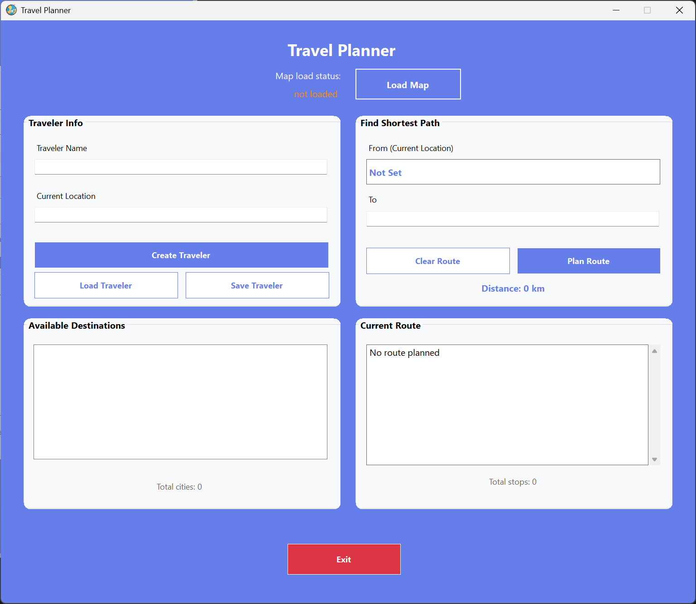
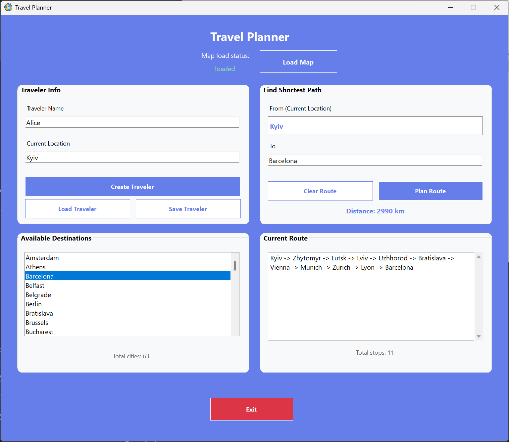

# 🧭 SmartTravelPlanner
<div align="center">
  

[](https://learn.microsoft.com/en-us/dotnet/csharp/)
[](https://dotnet.microsoft.com/)
[](https://learn.microsoft.com/en-us/dotnet/desktop/winforms/)
[](https://learn.microsoft.com/en-us/visualstudio/msbuild/msbuild)
[](LICENSE)
[]()
</div>

**SmartTravelPlanner** is a Windows Forms application built with **C#** and **.NET**, designed to help users create traveler profiles, load maps, and find the shortest routes between cities.

---

## ✨ Features

- 🗺️ **Map Loading** – Import a text-based map and view all available cities.  
- 👤 **Traveler Management** – Create, save, and load traveler profiles.  
- 🧮 **Route Planning** – Find the shortest path between two cities using graph-based logic.  
- 📋 **Route Overview** – Display total stops and travel distance.  
- 💾 **File Storage** – Save and load data in JSON format.  
- 🧰 **Dynamic UI** – Smooth, rounded UI panels and organized layouts.

---

## 📸 Screenshots

<details open>
<summary><b>View screenshots</b></summary>

<table>
  <tr>
    <td align="center" width="50%">
      
      <br><i>Main program window after program started.</i>
    </td>
    <td align="center" width="50%">
      
      <br><i>Example of filled inputs & how program works.</i>
    </td>
  </tr>
</table>

</details>

---

## 🧱 Project Structure

| Component | Description |
|------------|--------------|
| `Form1.cs` | Main application logic and event handling. |
| `Form1.Designer.cs` | User interface layout and controls. |
| `CityGraph` | Handles map data and pathfinding logic. |
| `Traveler` | Represents a traveler with name, location, and route. |
| `Resources/` | Contains icons, images, and static files. |
| `Data/` | Stores maps and traveler save files. |

---

## 🛠️ Technologies

- **Language:** C# 11  
- **Framework:** .NET 8.0 / Windows Forms  
- **Build System:** Visual Studio (MSBuild)  
- **Serialization:** JSON  
- **License:** MIT  

---

## 🚀 How to run

### 1️⃣ Clone the repository
```bash
git clone https://github.com/yourusername/SmartTravelPlanner.git
cd SmartTravelPlanner
```
### 2️⃣ Build and Run (Visual Studio)
- Open the SmartTravelPlanner.sln (or project file) in Visual Studio.
- Press Ctrl+F5 or the "Start" button (without debugging) to build and run the project.
### 3️⃣ Enjoy
Load your map, create a traveler, and start planning your trip!

---

📋 How to Use

1.  **Load a Map:**
    * Start the application.
    * Click the **"Load Map"** button.
    * Select a valid map file (see [Map File Format](#map-file-txt)). The map status will change to "loaded".
    * The "Available Destinations" list will populate with cities from the map.

2.  **Create a Traveler:**
    * In the "Traveler Info" section, enter your **Traveler Name** and **Current Location**.
    * Click **"Create Traveler"**. Your location will automatically appear in the "From" field.

3.  **Plan a Route:**
    * In the "Find Shortest Path" section, enter a **destination** ("To") manually or click one from the "Available Destinations" list.
    * Click **"Plan Route"**.
    * The shortest path will appear in the "Current Route" box. The total distance and stops will be calculated.

4.  **Save/Load (Optional):**
    * **Save:** After planning a route, click **"Save Traveler"** to save your profile and route to a `.json` file.
    * **Load:** Click **"Load Traveler"** to load a previously saved `.json` profile. This will auto-fill your details and route.

---

## 🗃️ Data Formats

### Map File (`.txt`)

The application expects a text file map in a specific format. Each line represents a single connection (edge) between two cities and its distance.

**Format:** `CityA-CityB,Distance`

**Example (`map.txt`):
```txt
Kyiv-Lviv,540
Kyiv-Odesa,475
Lviv-Odesa,743
Kyiv-Kharkiv,480
Kharkiv-Odesa,660
Lviv-Warsaw,380
Lviv-Ivano Frankivsk,140
```

---

### Traveler File (`.json`)

Traveler profiles are saved in JSON format, including the name, current location, and the list of cities in the planned route.

**Example (`Andriy.json`):**

```json
{
  "name": "Andriy",
  "currentLocation": "Kyiv",
  "route": [
    "Kyiv",
    "Lviv",
    "Warsaw"
  ]
}
